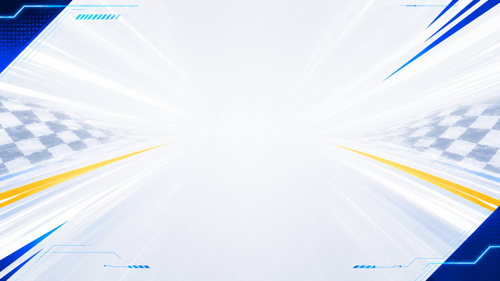

# Cart Rider

Cart Rider is a ROS 2 based browser-controlled racing cart project. It streams a live camera feed to a web browser, accepts keyboard driving input from the browser, and can overlay OpenCV motion detection, YOLOv5 object detection, and START/GOAL race timing on top of the video stream.



## Features

- Subscribes to the ROS 2 image topic `/camera/camera/color/image_raw`
- Serves a browser MJPEG stream at `http://<cart-ip>:8080/`
- Runs a separate HTTP control server at `http://<cart-ip>:8081/`
- Controls the cart with browser keyboard input
- Supports OpenCV motion detection and optional motion deblurring
- Supports CPU-based YOLOv5 object detection
- Measures race time with START/GOAL templates and color-based detection
- Applies low-latency defaults for race mode

## Requirements

This project is designed to run on the cart robot, not as a generic desktop-only demo.

- Linux with ROS 2 installed
- A ROS 2 camera driver publishing `sensor_msgs/msg/Image` on `/camera/camera/color/image_raw`
- A UART motor/control device connected at `/dev/ttyAMA0`
- Python 3
- Python packages: `rclpy`, `cv_bridge`, `sensor_msgs`, `cv2`, `numpy`, `pyserial`
- YOLOv5 directory and `.pt` weights file for YOLO mode

## Quick Start

```bash
cd ~/cart_rider
./run_cart_rider
```

Open the URL printed in the terminal from a browser on the same network.

```text
http://<cart-ip>:8080/
```

Follow the title screen prompts to choose a mode. Streaming and browser control start after a mode is selected.

## Modes

The title screen lets you choose either Race Mode or Debug Mode.

### Race Mode

Race Mode is intended for timed driving.

- Shows a YOLO-based warning when a person appears
- Detects START and GOAL signs to measure elapsed race time
- Applies lower-latency streaming and YOLO defaults
- Shows the final time after the goal is detected

Race Mode applies these defaults internally:

```bash
CART_RIDER_STREAM_FPS=6
CART_RIDER_JPEG_QUALITY=35
CART_RIDER_YOLO_IMGSZ=160
CART_RIDER_YOLO_EVERY_N=30
CART_RIDER_YOLO_TORCH_THREADS=1
CART_RIDER_YOLO_MAX_DET=4
CART_RIDER_RACE_EVERY_N=5
```

### Debug Mode

Debug Mode lets you choose the streaming pipeline directly.

```text
1: Only streaming
2: OpenCV-only detection streaming
3: Object detection streaming w/ YOLO
```

## Browser Controls

Click the streaming page once, then use the keyboard.

```text
w: forward
a: left forward
d: right forward
s: backward
z: left backward
c: right backward
b: boost
q: quit
Backspace: previous screen
```

The base speed is `150`, and boost speed is `250`. Boost lasts for 5 seconds and has a 30-second cooldown.

## YOLO Configuration

The default YOLO paths are:

```text
YOLOv5 root: /home/cartrider/yolov5
Default weights: /home/cartrider/yolov5/yolov5n.pt
Default site-packages: /home/cartrider/yolov5/yolov5/lib/python3.12/site-packages
```

To use a different model file, set `CART_RIDER_YOLO_WEIGHTS`.

```bash
cd ~/cart_rider
CART_RIDER_YOLO_WEIGHTS=/path/to/model.pt ./run_cart_rider
```

For lower latency:

```bash
CART_RIDER_YOLO_WEIGHTS=/home/cartrider/yolov5/yolov5n.pt \
CART_RIDER_YOLO_IMGSZ=224 \
CART_RIDER_YOLO_EVERY_N=4 \
./run_cart_rider
```

For higher accuracy:

```bash
CART_RIDER_YOLO_WEIGHTS=/home/cartrider/yolov5/yolov5n.pt \
CART_RIDER_YOLO_IMGSZ=320 \
CART_RIDER_YOLO_EVERY_N=3 \
./run_cart_rider
```

If the YOLOv5 virtual environment needs additional packages:

```bash
cd ~/yolov5
source yolov5/bin/activate
pip install pandas pyyaml requests scipy tqdm packaging psutil thop ultralytics seaborn
```

If `torch` and `torchvision` are already installed, they do not need to be installed again.

## Environment Variables

| Variable | Default | Description |
| --- | --- | --- |
| `CART_RIDER_CONTROL_PORT` | `8081` | HTTP port for browser driving control |
| `CART_RIDER_JPEG_QUALITY` | `55` | JPEG quality for MJPEG streaming |
| `CART_RIDER_STREAM_FPS` | `12` | Maximum stream encoding FPS |
| `CART_RIDER_DEBLUR` | disabled | Enables OpenCV deblurring when set to `1`, `true`, `yes`, or `on` |
| `CART_RIDER_DEBLUR_LENGTH` | `9` | Motion deblur kernel length |
| `CART_RIDER_DEBLUR_ANGLE` | `0` | Motion deblur angle |
| `CART_RIDER_DEBLUR_AMOUNT` | `0.7` | Motion deblur strength |
| `CART_RIDER_YOLOV5_ROOT` | `/home/cartrider/yolov5` | YOLOv5 project path |
| `CART_RIDER_YOLOV5_SITE` | `/home/cartrider/yolov5/yolov5/lib/python3.12/site-packages` | YOLOv5 virtualenv site-packages path |
| `CART_RIDER_YOLO_WEIGHTS` | `/home/cartrider/yolov5/yolov5n.pt` | YOLOv5 weights file |
| `CART_RIDER_YOLO_IMGSZ` | `256` | YOLO input image size |
| `CART_RIDER_YOLO_CONF` | `0.35` | YOLO confidence threshold |
| `CART_RIDER_YOLO_IOU` | `0.45` | YOLO NMS IoU threshold |
| `CART_RIDER_YOLO_MAX_DET` | `12` | Maximum detections per frame |
| `CART_RIDER_YOLO_EVERY_N` | `5` | Run YOLO inference every N frames |
| `CART_RIDER_YOLO_TORCH_THREADS` | `2` | PyTorch CPU thread count |
| `CART_RIDER_RACE_EVERY_N` | `3` | Check race templates every N frames |
| `CART_RIDER_START_THRESHOLD` | `0.62` | START template matching threshold |
| `CART_RIDER_GOAL_THRESHOLD` | `0.62` | GOAL template matching threshold |
| `CART_RIDER_RESULT_DELAY_SEC` | `3.0` | Delay before displaying the race result overlay |

## Project Structure

```text
cart_rider/
├── run_cart_rider              # Launch wrapper
├── RUN_COMMANDS.md             # Common run commands
├── README.md                   # Project documentation
├── data/
│   ├── START.png               # START detection template
│   └── GOAL.png                # GOAL detection template
├── figure/
│   ├── Rover.png               # Rover image for the title screen
│   └── background.png          # Title screen background
└── scripts/
    ├── main.py                 # Main flow and server/thread management
    ├── title.py                # Title and mode-selection web UI
    ├── ctrl_cart.py            # UART driving command generation and sending
    ├── camera_stream.py        # ROS image subscription and OpenCV MJPEG streaming
    ├── camera_stream_yolo.py   # YOLOv5 object detection streaming
    ├── stream_http.py          # MJPEG and control HTTP handlers
    ├── stream_config.py        # Shared settings and environment variables
    ├── stream_overlays.py      # Stream overlay rendering
    ├── opencv_tools.py         # OpenCV motion detection and deblurring
    └── race_timer.py           # START/GOAL detection and race timer
```

## Runtime Flow

1. `./run_cart_rider` launches `python3 scripts/main.py`.
2. `title.py` serves the title and mode-selection page on port `8080`.
3. After a mode is selected, the title server stops and the stream server starts.
4. `camera_stream.py` or `camera_stream_yolo.py` subscribes to the ROS image topic.
5. The latest frame is JPEG-encoded and served through `/stream.mjpg`.
6. Browser key events are sent to `/control` on port `8081`.
7. `ctrl_cart.py` converts key input into UART JSON commands and writes them to `/dev/ttyAMA0`.

## Troubleshooting

- If the browser page does not open, check the IP address and port `8080` printed in the terminal.
- If keyboard control does not work, click the streaming page once and try again.
- If the camera stream is blank, confirm that the ROS 2 image topic is being published.
  ```bash
  ros2 topic hz /camera/camera/color/image_raw
  ```
- If YOLO detection does not appear, check the `.pt` weights path and the YOLOv5 virtualenv path.
- If driving commands are not sent, check the `/dev/ttyAMA0` connection and permissions.
